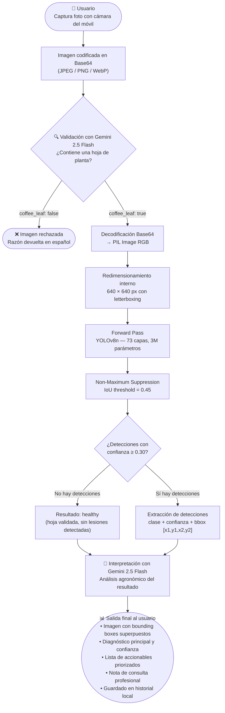

# Pipeline del Sistema — Coffee Leaf AI

Sistema de detección de enfermedades en hojas de café mediante Visión Computacional. El pipeline integra captura de imagen desde dispositivo móvil, validación con LLM multimodal, detección de objetos con YOLOv8n e interpretación agronómica generativa.

---

## Diagrama del Pipeline



---

## Descripción de Etapas

### Etapa 1 — Entrada de Datos

| Atributo | Detalle |
|---|---|
| Fuente | Cámara del dispositivo móvil vía `getUserMedia` API |
| Formato de transmisión | Base64 Data URL (`data:image/jpeg;base64,...`) |
| Formatos soportados | JPEG, PNG, WebP |
| Transporte | JSON sobre HTTPS (`{ "image": "<base64>" }`) |

El frontend captura la imagen directamente desde la cámara del dispositivo sin almacenarla en un servidor. La codificación en Base64 permite transmitir binarios de imagen como texto plano dentro del cuerpo JSON, eliminando la necesidad de multipart/form-data y simplificando el contrato de la API.

---

### Etapa 2 — Preprocesamiento y Validación (Gemini 2.5 Flash)

Antes de invocar el modelo de CV, se ejecuta un **pre-filtro semántico** usando un LLM multimodal. Su objetivo es descartar imágenes que no correspondan a hojas de planta (fondos, personas, objetos, ramas sin follaje) para evitar inferencias sin sentido.

**Criterios de aceptación (modo permisivo):**
- Presencia de cualquier hoja de planta, en cualquier estado: sana, dañada, doblada, decolorada o enferma.
- Imágenes parciales, primeros planos o condiciones de iluminación subóptimas son aceptadas.
- No se exige identificar la especie; la clasificación de enfermedad es responsabilidad de YOLOv8n.

**Respuesta estructurada (Pydantic + structured output):**
```json
{ "coffee_leaf": true }
{ "coffee_leaf": false, "reason": "La imagen muestra una mano, no una hoja." }
```

La decisión de usar Gemini como filtro previo (en lugar de un clasificador binario entrenado) se justifica por su capacidad de rechazar casos edge sin necesidad de dataset etiquetado adicional y por la flexibilidad de ajustar el criterio modificando solo el prompt.

---

### Etapa 3 — Modelo de Visión Computacional (YOLOv8n)

El core del sistema es un modelo **YOLOv8n fine-tuned** sobre el dataset Coffee Leaf v6 (Roboflow). YOLOv8 es un detector one-stage que realiza clasificación y regresión de bounding boxes en una sola pasada por la red, lo que permite inferencia en tiempo real incluso en CPU.

**Parámetros de inferencia:**

| Parámetro | Valor | Justificación |
|---|---|---|
| `imgsz` | 640 | Resolución usada durante el entrenamiento |
| `conf` | 0.30 | Umbral bajo para maximizar recall en campo |
| `iou` | 0.45 | NMS balanceado para lesiones solapadas |

**Clases del modelo:**

| ID | Clase | Enfermedad |
|---|---|---|
| 0 | `healthy` | Hoja sana |
| 1 | `miner` | Minador de hoja (*Leucoptera coffeella*) |
| 2 | `phoma` | Mancha de hierro (*Phoma* spp.) |
| 3 | `rust` | Roya del café (*Hemileia vastatrix*) |

**Proceso interno de inferencia:**
1. Decodificación Base64 → bytes → PIL Image convertida a RGB.
2. YOLO redimensiona internamente la imagen a 640×640 aplicando letterboxing (relleno gris) para preservar el aspect ratio.
3. Forward pass a través de las 73 capas fusionadas del modelo (3.006.428 parámetros).
4. Las predicciones crudas pasan por NMS para eliminar detecciones redundantes.
5. Las coordenadas de los bounding boxes se reescalan de vuelta al espacio de la imagen original.

**Fallback a `healthy`:** Si ninguna detección supera `conf=0.30`, el sistema retorna `healthy`. Esto es correcto porque la imagen ya fue validada como hoja de planta por Gemini; la ausencia de detecciones implica ausencia de lesiones visibles.

---

### Etapa 4 — Procesamiento de Resultados

El servicio `yolo.py` transforma la salida cruda de Ultralytics en un contrato JSON estable:

```json
{
  "detections": [
    { "disease": "rust",  "confidence": 0.848, "bbox": [45.0, 120.3, 390.5, 480.1] },
    { "disease": "miner", "confidence": 0.712, "bbox": [200.0, 50.0, 320.0, 180.0] }
  ],
  "classification_time": 1.13
}
```

El frontend recibe el array completo de detecciones y:
- Dibuja los bounding boxes sobre la imagen usando coordenadas porcentuales (`bbox / dimensión_natural`), sin necesidad de conocer el tamaño de procesamiento interno de YOLO.
- Deriva la enfermedad principal como la detección de mayor confianza.
- Muestra badges individuales si hay múltiples enfermedades detectadas.

---

### Etapa 5 — Uso Final de la Salida (Interpretación Generativa)

Una vez obtenidas las detecciones, se hace una segunda llamada a Gemini 2.5 Flash para generar una **interpretación agronómica contextualizada**:

```
Entrada: lista de enfermedades detectadas con su confianza
Salida estructurada:
  - summary: estado fitosanitario (2-3 oraciones)
  - actions: lista de 3-5 accionables concretos e inmediatos
  - professional_note: recomendación de consulta profesional
```

Esta etapa convierte un resultado técnico (IDs de clase + confianzas) en información accionable para el agricultor, sin requerir conocimiento previo sobre enfermedades del café. La interpretación también maneja el caso de hoja sana, devolviendo consejos de mantenimiento preventivo.

La salida final se persiste en `localStorage` como registro histórico, permitiendo al usuario consultar diagnósticos anteriores sin necesidad de backend.

---

## Integración Lógica entre Componentes

```
Frontend (React)          Backend (Flask)           Servicios externos
─────────────────         ───────────────           ──────────────────
CameraCapture
    │ base64
    ▼
validateCoffeeLeaf ──────► POST /validate ──────────► Gemini 2.5 Flash
    │ coffee_leaf: bool ◄──────────────────────────────────────────
    │ [si false → error screen]
    │ [si true ↓]
classifyDisease ─────────► POST /classify
    │                           │
    │                       yolo.py
    │                           │ best.pt (YOLOv8n)
    │ detections[] ◄────────────┘
    │
interpretDetections ─────► POST /interpret ─────────► Gemini 2.5 Flash
    │ summary+actions ◄────────────────────────────────────────────
    │
DiseaseResultScreen
    │
localStorage (history)
```

**Coherencia del flujo:** Cada etapa tiene una única responsabilidad y un contrato bien definido. Gemini actúa como guardián semántico de entrada y como generador de lenguaje natural de salida; YOLOv8n es el único responsable de la detección visual. Esta separación permite reemplazar cualquier componente (e.g., migrar a YOLOv8n-seg para segmentación con máscaras) sin afectar el resto del pipeline.
