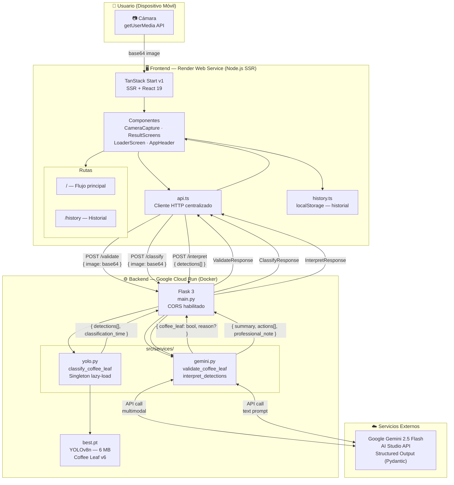
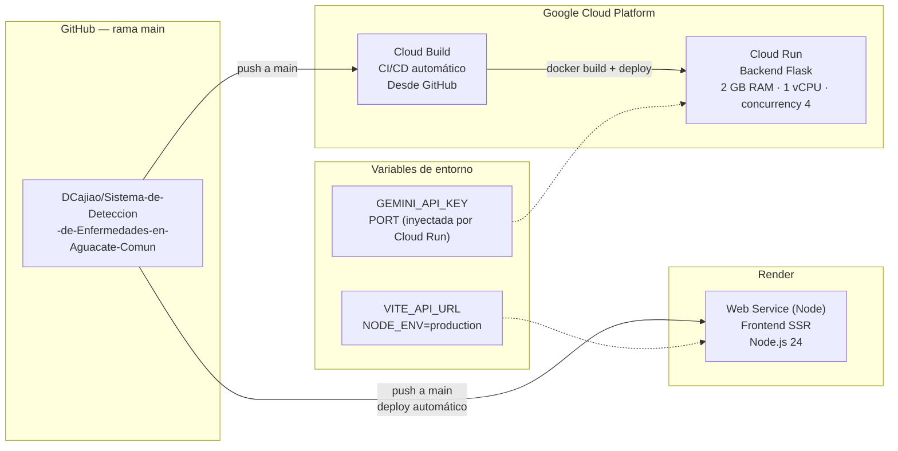

# Arquitectura del Sistema — Coffee Leaf AI

---

## Diagrama de Arquitectura General



---

## Componentes del Sistema

### Frontend

| Elemento | Tecnología | Rol |
|---|---|---|
| Framework | TanStack Start v1 (SSR) | Renderizado en servidor, hidratación en cliente |
| UI | React 19 + Tailwind CSS v4 | Interfaz reactiva, diseño mobile-first |
| Componentes base | shadcn/ui + Radix UI | Accesibilidad y consistencia visual |
| Routing | TanStack Router (file-based) | Rutas tipadas, scroll restoration manual |
| Build | Vite 7 + Nitro | Bundle optimizado, target Node.js (Render) |
| Paquetes | pnpm 11 | Instalación determinista vía lockfile |

**Flujo de estado en el cliente (`index.tsx`):**

```
intro → capture → validating → [not-coffee-leaf | classifying] → result
```

Cada transición es un objeto de estado tipado (`Step`) que contiene exactamente los datos que necesita la pantalla correspondiente. No hay estado global ni contexto compartido — toda la lógica vive en el componente `Index`.

**Gestión de la imagen con bboxes:**
El componente `ImageWithBoxes` superpone `<div>` absolutamente posicionados sobre la imagen usando coordenadas porcentuales calculadas en el momento de carga (`onLoad → naturalWidth/naturalHeight`). No se usa canvas para mantener el árbol DOM accesible.

---

### Backend

| Elemento | Tecnología | Rol |
|---|---|---|
| Framework | Flask 3 | API REST, routing de endpoints |
| CORS | flask-cors | Permite requests desde el frontend en otro dominio |
| Gestión de paquetes | UV | Resolución y ejecución del entorno Python |
| Containerización | Docker (python:3.13-slim) | Imagen reproducible para Cloud Run |
| Logging | Python `logging` | Trazabilidad de cada etapa en Cloud Logging |

**Endpoints:**

| Endpoint | Servicio | Descripción |
|---|---|---|
| `POST /validate` | `gemini.py` | Pre-filtro semántico: ¿es una hoja? |
| `POST /classify` | `yolo.py` | Detección de enfermedades con YOLOv8n |
| `POST /interpret` | `gemini.py` | Interpretación agronómica de las detecciones |

**Decisiones de implementación del backend:**
- **Carga lazy del modelo:** `_model` se instancia en el primer request, no al arrancar Flask. Esto reduce el tiempo de cold start en Cloud Run.
- `torch.backends.nnpack.enabled = False` desactiva el intento de usar NNPACK (no disponible en la CPU virtualizada de Cloud Run), eliminando warnings masivos en los logs.
- **opencv-python-headless:** La imagen Docker usa la variante headless de OpenCV para evitar dependencias de X11 (`libxcb`) que no existen en contenedores sin display.

---

### Infraestructura de Despliegue



---

## Proceso de Desarrollo Técnico del Modelo

### Dataset — Coffee Leaf v6 (Roboflow)

| Atributo | Valor |
|---|---|
| Fuente | Roboflow Universe — `tugas-akhir-adf4p/coffee-leaf` |
| Versión | 6 |
| Imágenes de entrenamiento | 3.993 |
| Imágenes de validación | 167 |
| Formato de anotación | YOLOv8 (bounding boxes normalizados) |
| Resolución estándar | 640 × 640 px |
| Clases | 4: `healthy`, `miner`, `phoma`, `rust` |
| Licencia | CC BY 4.0 |

**Distribución de clases (train set):**

La clase `rust` presenta la mayor cantidad de instancias (~11 por imagen en promedio) y la mayor variabilidad visual, lo que explica su menor AP@0.5 (0.865) frente a las otras tres clases (>0.98). Las clases `healthy`, `miner` y `phoma` tienen morfología más delimitada y consistente.

---

### Entrenamiento

**Modelo base:** YOLOv8n preentrenado en COCO (80 clases, 118.000 imágenes). Se utiliza fine-tuning en lugar de entrenamiento desde cero para aprovechar las características visuales genéricas ya aprendidas (bordes, texturas, formas), reduciendo la cantidad de datos necesaria y el riesgo de overfitting.

**Configuración de entrenamiento:**

```python
model.train(
    data      = "data.yaml",       # Coffee Leaf v6
    epochs    = 50,
    imgsz     = 640,
    batch     = 16,
    lr0       = 0.01,
    patience  = 15,                # Early stopping
    # Aumentación de datos
    mosaic    = 1.0,               # Combina 4 imágenes
    fliplr    = 0.5,               # Flip horizontal
    flipud    = 0.0,               # Sin flip vertical
    degrees   = 10.0,              # Rotación ±10°
    mixup     = 0.1,               # Mezcla suave de imágenes
)
```

**Justificación de la aumentación:**
- `mosaic`: expone al modelo a objetos en escalas variadas dentro de la misma imagen, especialmente útil para las manchas pequeñas de `rust`.
- `fliplr=0.5`: las enfermedades no tienen orientación preferencial en campo.
- `flipud=0.0`: en campo, las hojas rara vez están completamente invertidas.
- `mixup=0.1`: suaviza las distribuciones de confianza y reduce overfitting.

---

### Métricas de Evaluación

**Resultados globales (validation set, epoch 50):**

| Métrica | Valor |
|---|---|
| Precision | **0.938** |
| Recall | **0.961** |
| mAP@0.5 | **0.959** |
| mAP@0.5:0.95 | **0.710** |

**Métricas por clase:**

| Clase | AP@0.5 | Precision | Recall |
|---|---|---|---|
| `healthy` | 0.995 | 1.000 | 1.000 |
| `miner` | 0.982 | 0.949 | 0.982 |
| `phoma` | 0.993 | 0.939 | 1.000 |
| `rust` | 0.865 | 0.865 | 0.864 |

**Velocidad de inferencia (CPU):**

| Etapa | Tiempo |
|---|---|
| Preprocesamiento | ~3.6 ms/imagen |
| Inferencia (forward pass) | ~4.7 ms/imagen |
| Postprocesamiento (NMS) | ~1.9 ms/imagen |

---

### Proceso Iterativo de Decisiones Técnicas

```mermaid
flowchart LR
    D1["Selección del modelo base\nYOLOv8n vs s vs m"]
    D2["Selección del dataset\nRoboflow Coffee Leaf v6"]
    D3["Configuración de\naumentación de datos"]
    D4["Early stopping\npatience=15"]
    D5["Umbral de confianza\nconf=0.30"]
    D6["Evaluación de errores\nFP y FN por clase"]
    D7["Decisión de arquitectura\ndetección vs segmentación"]

    D1 -->|"YOLOv8n: 3M params\nbalance velocidad/precisión\npara CPU en producción"| D2
    D2 -->|"3993 imágenes train\n4 clases anotadas\nCC BY 4.0"| D3
    D3 -->|"mosaic + mixup\nflip horizontal\nrotación ±10°"| D4
    D4 -->|"Convergencia ~épocas 30-35\nPatience=15 evita\nsobreentrenamiento"| D5
    D5 -->|"0.30 maximiza recall\nen condiciones de campo\nmejor que 0.25 o 0.50"| D6
    D6 -->|"rust: mayor FP y FN\nlesiones pequeñas y densas\niluminación variable"| D7
    D7 -->|"Pendiente: evaluar migración\na YOLOv8n-seg con máscaras\npara mayor precisión espacial"| D1
```



**Decisiones clave y su justificación:**

| Decisión | Alternativa descartada | Razón |
|---|---|---|
| YOLOv8n (nano) | YOLOv8s/m | Inferencia en CPU de Cloud Run; nano es suficiente con mAP@0.5 = 0.959 |
| conf=0.30 | conf=0.50 | En aplicación agrícola, un falso negativo (enfermedad no detectada) es más costoso que un falso positivo |
| Gemini como pre-filtro | Clasificador binario entrenado | Flexibilidad sin dataset adicional; ajustable por prompt |
| Detección (bboxes) | Clasificación global | Permite múltiples enfermedades en una sola hoja y localización espacial |
| Singleton lazy-load | Carga al arrancar Flask | Reduce cold start en Cloud Run sin penalizar requests subsiguientes |

---

### Análisis de Errores (Validation Set)

Sobre 167 imágenes de validación:

| Métrica | Valor |
|---|---|
| Total falsos positivos | 102 |
| Total falsos negativos | 62 |
| Imágenes sin errores | 123 / 167 (73.7%) |

**Causas identificadas en las imágenes con mayor cantidad de errores:**

1. **Densidad y agrupamiento de lesiones pequeñas (`rust`):** Zonas con manchas de roya muy juntas generan tanto FN (lesiones individuales omitidas) como FP redundantes (múltiples cajas sobre el mismo grupo de manchas).

2. **Variabilidad de iluminación:** Imágenes con baja luminosidad o sobreexposición reducen el contraste entre la lesión y el tejido sano, afectando principalmente a `rust`.

3. **Clorosis confundida con rust:** Zonas amarillentas por deficiencia mineral generan FP de `rust` debido a similitud cromática con las esporas.

---

### Validación Funcional del Sistema

El sistema fue validado end-to-end mediante:

- **Pruebas de inferencia local:** Verificación de que `model.names` coincide con `CLASS_NAMES` en `yolo.py` (`{0: healthy, 1: miner, 2: phoma, 3: rust}`).
- **Prueba de endpoints en Cloud Run:** Confirmación de respuestas correctas con imágenes reales capturadas desde móvil (ver logs de Cloud Logging en el repositorio).
- **Validación del pre-filtro Gemini:** La relajación del prompt (de criterios morfológicos estrictos de *Coffea* a "cualquier hoja") corrigió falsos rechazos de hojas dañadas o dobladas con enfermedad activa.
- **Verificación de bounding boxes en frontend:** Las coordenadas porcentuales se alinean correctamente con las lesiones visibles en la imagen, confirmando que la reescala YOLO → espacio original → porcentaje display es correcta.
